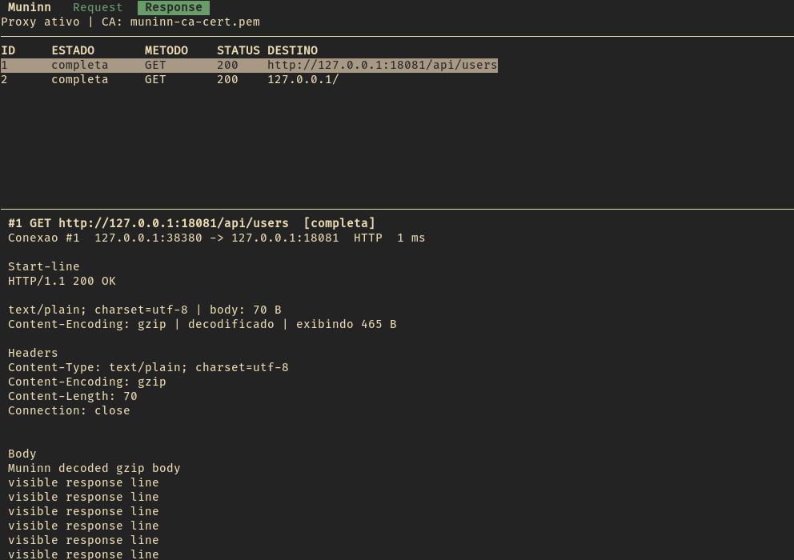

# Muninn

```text
                              ___
                          _.-'   '-._
                       .-'           '.
                     .'      __        \
                    /      .'  '.       |
                   ;      /  o   \      |
                   |      \      /  _.-'-----.__
                    \      '----'.-'            _ '>
                     '._        /      __..---''
                        '--.___/__.---'
                              / /
                         ____/ /____
                        /___________\
                         Muninn observa.
```

Na mitologia nordica, Muninn e um dos dois corvos de Odin. Ao lado de Huginn,
ele percorre o mundo e retorna para contar o que viu. Huginn costuma ser
associado ao pensamento; Muninn, a memoria.

Muninn e um inspetor HTTP/HTTPS local e somente leitura, escrito em C99. Ele
fica entre o navegador e os servidores, encaminha o trafego sem pausa ou
modificacao e apresenta requests e responses em uma TUI ncurses.

Ele nao e um scanner de vulnerabilidades nem uma alternativa completa ao Burp
Suite. Seu objetivo e menor: tornar visivel o trafego HTTP/1.x de um navegador
em uma ferramenta de terminal simples, limitada e auditavel.



## Recursos

- Proxy HTTP/1.x com relay nao bloqueante e conexoes concorrentes.
- MITM HTTPS com CA local, SNI, verificacao upstream e certificados em cache.
- Historico em memoria com Request/Response, headers, bodies e metadados TLS.
- Busca livre e filtros por metodo, host, status e estado.
- Texto, hexdump e decodificacao visual de gzip, deflate e Brotli.
- Limites de memoria, truncamento explicito e descarte de registros antigos.
- Passthrough por host para pinning e protocolos que devem permanecer opacos.
- Testes, sanitizers, concorrencia e fuzzing executados localmente.

## Compilacao

Dependencias no Debian:

```sh
sudo apt install build-essential libncurses-dev libssl-dev zlib1g-dev libbrotli-dev
```

Compile e execute os testes:

```sh
make
make check
```

O executavel sera criado como `./muninn`. A release 0.1.0 foi validada no
Debian com GNU make. O codigo segue C99/POSIX e estilo inspirado no OpenBSD,
mas compatibilidade nativa com OpenBSD ainda nao e declarada sem validacao
nesse sistema.

### Instalacao opcional

```sh
sudo make install
man muninn
```

O destino padrao e `/usr/local`. Para instalar somente no usuario:

```sh
make install PREFIX="$HOME/.local"
```

`PREFIX` e `DESTDIR` podem ser sobrescritos para empacotamento.

## Uso com Firefox

### 1. Prepare a CA local

```sh
./muninn ca create
./muninn ca fingerprint
```

Os arquivos criados possuem papeis diferentes:

```text
muninn-ca-cert.pem  certificado publico para importar no navegador
muninn-ca-key.pem   chave privada que deve permanecer somente nesta maquina
```
Nunca importe, compartilhe ou envie `muninn-ca-key.pem`.

### 2. Importe o certificado publico

Use preferencialmente um perfil separado do Firefox.

1. Abra **Configuracoes**.
2. Entre em **Privacidade e Seguranca**.
3. Procure a secao **Certificados**.
4. Clique em **Ver certificados**.
5. Abra a aba **Autoridades**.
6. Clique em **Importar**.
7. Selecione somente `muninn-ca-cert.pem`.
8. Autorize a CA a identificar sites.

### 3. Configure o proxy

Em **Configuracoes**, **Geral**, **Configuracoes de rede**:

1. Selecione **Configuracao manual de proxy**.
2. Em **Proxy HTTP**, informe `127.0.0.1`.
3. Em **Porta**, informe `13337`.
4. Marque a opcao para usar o proxy tambem em HTTPS.
5. Confirme as alteracoes.

Nao adicione os sites que deseja observar na lista **Sem proxy para**.

### 4. Inicie e navegue

```sh
./muninn
```

Muninn escuta em `127.0.0.1:13337`. Mantenha o terminal aberto e navegue
normalmente no Firefox configurado.

## Interface

A tabela superior lista metodo, estado, status e destino. O painel inferior
mostra a Request ou Response selecionada.

| Tecla | Acao |
| --- | --- |
| `Up`, `Down`, `j`, `k` | Seleciona uma transacao |
| `Left`, `Right`, `Tab` | Alterna entre Request e Response |
| `Page Up`, `Page Down`, `u`, `d` | Rola os detalhes |
| `g`, `G` | Vai para a primeira ou ultima transacao visivel |
| `/` | Edita a busca |
| `c` | Limpa a busca atual |
| `C` | Remove da memoria as transacoes encerradas |
| `e` | Alterna entre historico e eventos operacionais |
| `q` | Encerra o Muninn |

Requests ativas nunca sao removidas por `C`. Bodies textuais aparecem como
texto; bodies com bytes de controle usam hexdump. gzip, deflate e Brotli sao
decodificados somente para exibicao, preservando os bytes capturados.

## Busca

Termos simples procuram nos campos, headers e bytes armazenados. Termos
separados por espaco possuem semantica AND. Filtros estruturados podem ser
combinados:

```text
method:POST host:example.com
status:404
state:erro
```

Conteudo comprimido e pesquisado em sua forma bruta e decodificado quando a
transacao e selecionada para exibicao.

## Opcoes

| Opcao | Padrao | Finalidade |
| --- | --- | --- |
| `--max-memory TAMANHO` | `8M` | Memoria dinamica total do historico |
| `--max-body TAMANHO` | `64K` | Bytes guardados por body |
| `--max-headers TAMANHO` | `64K` | Bytes guardados por bloco de headers |
| `--max-transactions N` | `2048` | Quantidade maxima de transacoes |
| `--max-connections N` | `512` | Quantidade maxima de conexoes |
| `--passthrough HOST` | desativado | Mantem o TLS de um host opaco |
| `--insecure-upstream` | desativado | Desabilita verificacao TLS upstream |

Tamanhos aceitam bytes ou os sufixos binarios `K`, `M` e `G`.

Exemplo:

```sh
./muninn --max-memory 16M --max-body 128K
./muninn --passthrough exemplo.com
```

Use `--insecure-upstream` somente quando um certificado invalido for
deliberadamente esperado em um servidor de desenvolvimento.

## Escopo e limitacoes

- Muninn observa e encaminha; nao pausa, edita, repete ou exporta trafego.
- TLS anuncia somente `http/1.1`. HTTP/2 nao e decodificado.
- WebSockets e outros upgrades tornam-se opacos depois do handshake.
- Passthrough e conexoes com certificate pinning nao podem ser inspecionados.
- Headers e bodies muito grandes sao armazenados ate o limite configurado.
- A representacao decodificada possui limite proprio de 256 KiB.
- O historico existe somente em memoria e desaparece ao encerrar o processo.

Truncamento afeta somente o historico: o trafego encaminhado ao navegador
continua completo e inalterado.

## Depois dos testes

1. Pressione `q` para encerrar o Muninn.
2. Volte as configuracoes de rede do Firefox para **Sem proxy** ou para a
   configuracao usada anteriormente.
3. Remova ou deixe de confiar em **Muninn Local CA** no gerenciador de
   certificados do Firefox.

Sem o proxy ativo, o Firefox configurado para `127.0.0.1:13337` nao conseguira
navegar. Remover a confianca da CA evita que ela continue valida para
interceptacao futura.

## Desenvolvimento local

Nenhum servico de CI e necessario. A verificacao completa roda na propria
maquina:

```sh
make check
make fuzz-smoke
make sanitize
make thread-sanitize
```

`make fuzz-http` inicia libFuzzer quando `clang` estiver instalado. Consulte
[CONTRIBUTING.md](CONTRIBUTING.md) para o escopo aceito de mudancas.

## Seguranca

O trafego observado pode conter cookies, senhas e tokens. Leia
[SECURITY.md](SECURITY.md) antes de confiar a CA a um navegador. Nunca execute
o Muninn como root nem compartilhe `muninn-ca-key.pem`.

## Licenca

Muninn e distribuido sob a licenca ISC. Consulte [LICENSE](LICENSE).
